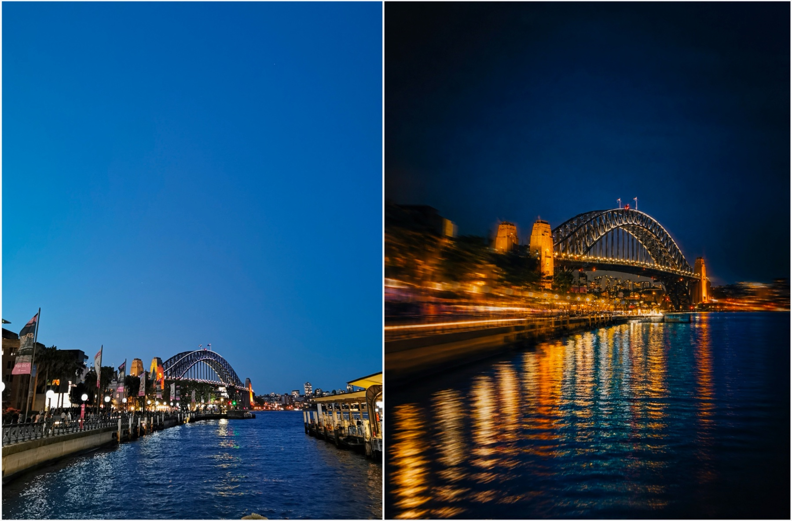
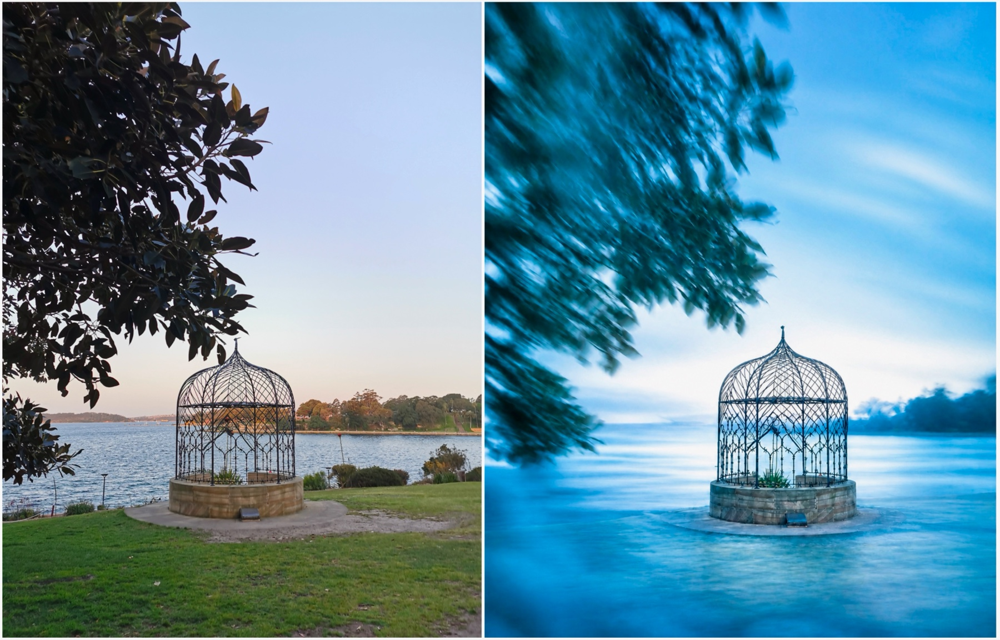
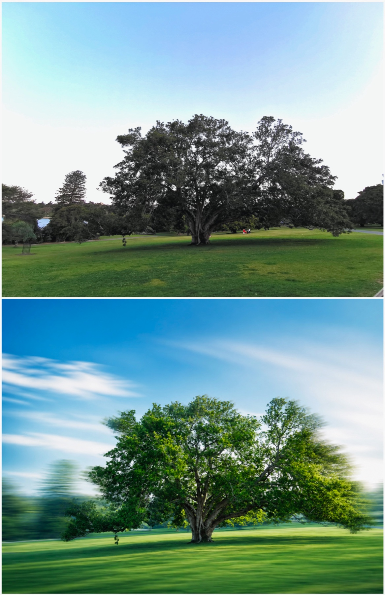

# dreamy-photo · 一句话完成照片梦幻化编辑


[English README](README.en.md) · [30 秒开始](#30-秒开始) · [效果预览](#效果预览) · [FAQ](#faq) · [联系作者](SUPPORT.md)

**作者 / 发布者**：[Jiaranbb](https://github.com/Jiaranbb) · **支持与反馈**：[SUPPORT.md](SUPPORT.md)

`dreamy-photo` 是一个将已有照片快速完成梦幻化、电影感或慢门摄影式编辑的 AI Skill。用户发来照片后，AI 会自动识别照片主体，用方向性运动、光学晕染、色彩重构和胶片质感完成梦幻化编辑，同时保留原照片的真实主体细节，并直接返回图片。

> 发一张照片，说「梦幻一下」，AI 自动完成梦幻化编辑并返回图片。

它适合希望快速提升旅行照、人物照、城市夜景、自然风景或静物照片氛围感，同时仍保留人物身份、肤色、关键结构与原始关系的 Codex、OpenClaw 和其他具备生图能力的 Agent 用户。

## 效果预览







示例图片由 Jiaranbb 提供并授权用于本项目公开展示。这些示例使用 ChatGPT Image 生成。图像生成具有随机性，实际结果会随源图、模型能力和生成过程变化。

使用时也可以明确要求 Skill 展示提示词，再把提示词手动提交到 Midjourney 等第三方图片生成平台。第三方结果取决于对应平台的模型能力与图生图支持。

## 30 秒开始

把下面这段话直接发给 Codex、OpenClaw、Claude Code、WorkBuddy 或其他支持 Skill 的 Agent：

```text
请从 GitHub 安装 dreamy-photo skill：https://github.com/Jiaranbb/dreamy-photo。安装完成后提醒我按当前工具要求重启或刷新 Agent，让新 Skill 生效。
```

如果你的环境支持 `skills` CLI，也可以执行：

```bash
npx skills add https://github.com/Jiaranbb/dreamy-photo --skill dreamy-photo
```

Codex 用户也可以手动安装：

```bash
python3 ~/.codex/skills/.system/skill-installer/scripts/install-skill-from-github.py \
  --repo Jiaranbb/dreamy-photo \
  --path . \
  --name dreamy-photo
```

安装完成后，按当前工具要求重启或刷新 Agent，让新 Skill 生效。

## 核心能力

- **自动识别主体**：AI 会判断照片中真正需要保留的人物、动作、物体、结构和关系，把主体细节设为最高保真优先级。
- **自动调整构图与色彩**：根据主体方向、画面比例、真实光源和原图色彩选择构图与情绪路线，强化电影感和整体氛围，而不是机械套用同一种色调。
- **分层运动景深**：把动态组织为前景掠影、中景拖影和背景光色流，同时建立主体清晰区，让主体更突出，不会整张照片均匀模糊。
- **人物专项保护**：对人像、手部和可见皮肤单独锁定原图肤色明度、冷暖底色、年龄感与柔和度，避免梦幻化后肤色变黑、皮肤变粗糙或人物显老。

## 直接这样用

安装后，发送照片并说：

```text
梦幻一下
```

默认行为是：显示简洁的照片诊断与视觉方案，调用当前平台可用的生图能力，并返回生成后的图片。不会默认展示完整提示词。

若只想看提示词，请明确说：

```text
只给我这张照片的梦幻化提示词，不要生成图片。
```

## 适合 / 不适合

**✅ 适合**

- 已有照片的梦幻化、电影感或慢门摄影式编辑。
- 希望强化色彩和氛围，同时保护主体身份与关键结构。
- 旅行、人物、城市夜景、自然风景、静物和建筑照片。
- 希望 Agent 默认直接生成并返回图片，而不是只写提示词。

**❌ 不适合**

- 无源图的一般图片生成。
- 普通美颜、去瑕疵、抠图或单纯校正白平衡。
- 与照片梦幻化无关的提示词写作。
- 要求像素级复刻、法证级保真或确定性输出的任务。

## 常见使用场景

| 任务 | 推荐说法 |
|---|---|
| 自然风景 | `保持横幅，把这张风景照梦幻化成明亮的盛夏风感。` |
| 城市夜景 | `强化冷蓝环境和暖金灯光，把次要建筑化成方向性光流。` |
| 人物照片 | `保留人物身份、肤色和动作关系，只让背景产生梦幻运动。` |
| 静物特写 | `保持主体材质清楚，用周围反光和背景做柔和光色流。` |
| 仅查看方案 | `只分析梦幻化方案和提示词，不生成图片。` |

## 平台支持

| 平台 | 状态 | 说明 |
|---|---|---|
| Codex | 支持 | 推荐环境；使用内置 `image_gen` 查看、编辑并返回图片 |
| OpenClaw | 支持 | 使用内置 `image_generate`；需要配置可用的图片生成模型 |
| Claude Code | 可适配 | 自带生图效果通常较弱；建议自行改造成调用 Codex CLI 完成生图 |
| WorkBuddy | 条件支持 | 必须选择具备生图和参考图编辑能力的模型；DeepSeek 等纯文本模型无法完成，效果取决于所选生图模型 |

## 工作方式

1. 识别主体、保真优先级、风险、光线、空间方向和可用动态素材。
2. 建立 Keep／Fade／Remove、主体清晰岛、曝光基线和动态边界。
3. 选择一个主机制和至多一个辅助机制。
4. 根据主体的水平、垂直或均衡方向选择画幅，不默认强制竖裁。
5. 选择与用户意图匹配的色彩方向，并与光线机制分开判断。
6. 生成图片后检查身份、肤色、曝光、结构、色偏、模糊范围和意外符号。
7. 若存在硬失败，只做一次针对最高影响问题的定向修订。

## 可选策略分析脚本

`scripts/analyze_photo.py` 不读取图片像素，只把人工观察结果转换成结构化建议：

```bash
python3 scripts/analyze_photo.py \
  --subject landscape \
  --light hard-sun \
  --background nature \
  --subject-axis horizontal \
  --mood summer-breeze \
  --strength dream-haze \
  --json
```

查看所有参数：

```bash
python3 scripts/analyze_photo.py --help
```

## 隐私与外部请求

| 数据或行为 | 处理位置 | 说明 |
|---|---|---|
| `analyze_photo.py` 的观察参数 | 本机 | 脚本本身不联网，也不读取照片内容 |
| 用户附加的照片 | 当前 Agent 与所选图片生成服务 | 为完成图片编辑，需要按平台能力处理源图 |
| 生成后的图片 | Agent 会话或用户指定位置 | 是否长期保存取决于平台与用户选择 |
| API Key、Cookie、账户凭证 | 不需要 | 本 Skill 不读取这些信息 |

请根据所使用的 Agent 与图片生成服务条款处理含有人脸、私人场景或其他敏感信息的照片。不要把私人测试照片、会话附件或生成结果提交到公开仓库。

## 限制与质量提醒

- 图像生成具有随机性；相同源图和方案也可能得到不同构图或细节。
- 人脸、手部、文字、Logo、重复结构和强透视仍可能发生漂移。
- 负面词不能完全阻止模型生成意外装饰符号，因此必须检查真实成图。
- Skill 可以约束艺术方向，但不能保证任何具体模型版本都得到相同效果。
- 重要人物照片应重点检查身份、肤色、年龄感、手部和主体曝光。

## FAQ

**为什么默认直接生成图片，而不是只给提示词？**

这个 Skill 的目标是完成照片编辑。默认流程会先诊断与设计方案，再调用当前平台可用的生图能力并返回图片；只有用户明确提出时才展示完整提示词。

**为什么不把整张照片都做模糊？**

梦幻感来自主体与环境的清晰度差异。Skill 会建立「主体清晰岛」，把运动和光色重组优先放在次要背景、前景边缘与真实光源附近。

**可以保持原来的横幅或竖幅吗？**

可以。默认会根据主体方向和构图关系判断画幅；如果画幅很重要，请在请求中明确说「保持横幅」「保持竖幅」或指定比例。

**人物肤色、年龄感或身份会不会改变？**

Skill 会把这些列为人物照片的高优先级保真项，但生成模型仍可能漂移。生成后必须检查；若发生明显变化，应只针对身份和肤色做定向修订。

**为什么偶尔会出现爱心或其他装饰符号？**

生成模型可能把「梦幻」「浪漫」误解为图形装饰。Skill 会明确禁止新增爱心、星星、贴纸、文字和符号，并在出图后检查，但负面约束不能保证绝对阻止。

**同一张照片为什么每次结果不完全一样？**

图片生成具有随机性。保真优先级、机制、色彩和动态范围可以约束方向，但不能固定每个像素和细节。

**如何更新到最新版本？**

如果通过 Git 克隆仓库，请先拉取最新版本，再按当前 Agent 的安装方式重新安装或同步 Skill；更新后重启或刷新 Agent。

## 验证

```bash
python3 -m py_compile scripts/analyze_photo.py
python3 -m unittest discover -s tests -v
python3 scripts/analyze_photo.py --help
```

结构校验需要使用 Codex 自带的 `skill-creator` 校验脚本。

## 作者与反馈

**[Jiaranbb](https://github.com/Jiaranbb)**

- GitHub：[github.com/Jiaranbb](https://github.com/Jiaranbb)
- 支持与反馈：[SUPPORT.md](SUPPORT.md)
- 问题与建议：[GitHub Issues](https://github.com/Jiaranbb/dreamy-photo/issues)

## License

MIT-0 License. See [LICENSE](LICENSE).

Copyright 2026 [Jiaranbb](https://github.com/Jiaranbb).
